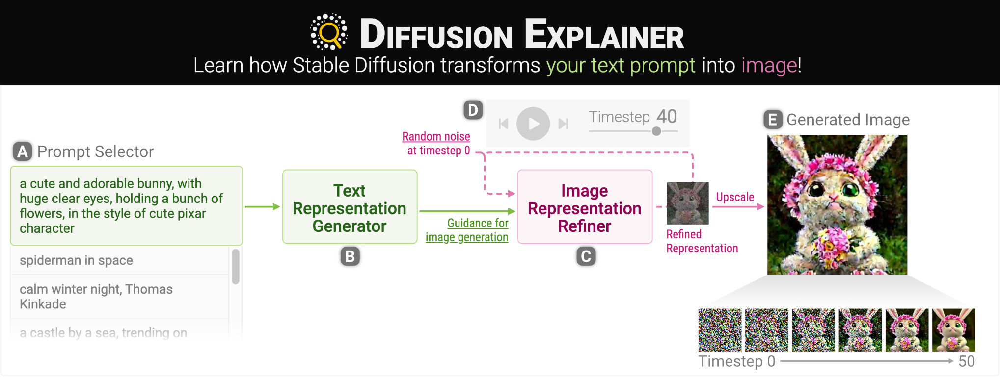

# Diffusion-Explainer
<!--  -->

<table>
<tr>
    <td colspan="4"></td>
</tr>
</table>

# How to run locally
```
git clone https://github.com/trylivedemo/diffusion-explainer.git
cd diffusion-explainer
python -m http.server 8000
```

Then, on your web browser, access http://localhost:8000.
You can replace 8000 with other port numbers you want to use.

# License
The software is available under the MIT License.

# Contact
If you have any questions, feel free to open an issue.